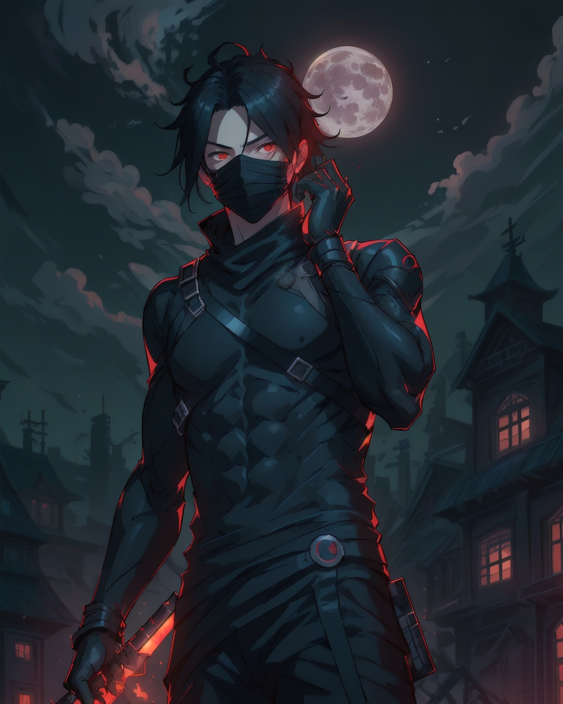

<!--horizontal divider(gradiant)-->

 
<!--h1 without bottom border-->

  <ul align="center">
    
<h1 style="display: inline-block">こんにちは 👋, I'm Ahamed Rasni Nathees</h1>

  </ul>

<!--- anime character gif -->

  

<!--h2 without bottom border-->

  <ul align="center">
    
<h2 style="display: inline-block">Navigating Code and Cosmos ✨</h2>

  </ul>

<!--Intro start-->

  
 🌟 I’m currently working on <strong>AWS, React, React Native, Nodejs, Vue, Angular, ASP.NET, Larave, JAVA MongoDB</strong>

  
 🌱 I’m diving into the <strong>Hyper Beast Stack</strong> for Scalable Applications.

  
 ☁️ Cloud computing enthusiast, mastering <strong>AWS</strong>

  
 📝 Regularly sharing knowledge on <a href="https://dev.to/rasni"><strong>Dev.to</strong></a>

  
 💬 Ask me about <strong>AWS, React, React Native, Nodejs, Vue, Angular, ASP.NET, Larave, JAVA MongoDB</strong>

  <!-- 
 📫 Reach out at <strong>your-email@example.com</strong>
 -->
  <!-- 
 🏠 Connect with me on Discord: <a href="https://discordapp.com/users/your-discord-id"><strong>YourDiscordUsername</strong></a>
 -->

<!--Intro end-->

<!--- stats & Trophy (start) -->

  <!--- stats (start) -->
<table align="center">
<tr border="none">
<td width="50%" align="center">
  
    
   
</td>

<td width="50%" align="center">
  
</td>
</tr>
</table>
<!--- stats (end) -->

<!--- trophy (start) -->

  

<!--- trophy (end) -->

<!--h2 without bottom border-->

  <ul align="center">
    
<h2 style="display: inline-block">Technologies That I Know 👨🏻‍💻</h2>

  </ul>

<!--tech stack icons-->

  

<!-- Connect with me -->
<!--h2 without bottom border-->

  <ul align="center">
    
<h2 style="display: inline-block">Connect With Me 🤝</h2>

  </ul>

<!--icons and links-->

 

<!--  -->

<!--profile visit count-->

<!--weather widget-->
<!-- 

  

 -->

<!--horizontal divider(gradiant)-->

----------------------------------------------------------------------
Credit: [Ahamed Rasni Nathees](https://github.com/RasniNathees)

Last Edited 05/08/2024
